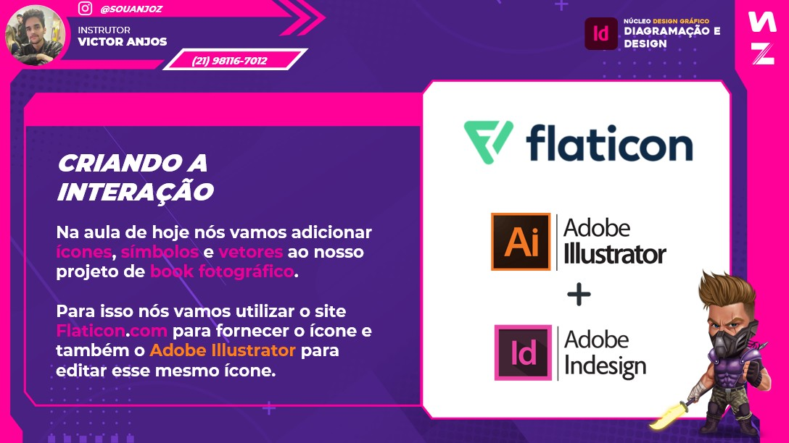
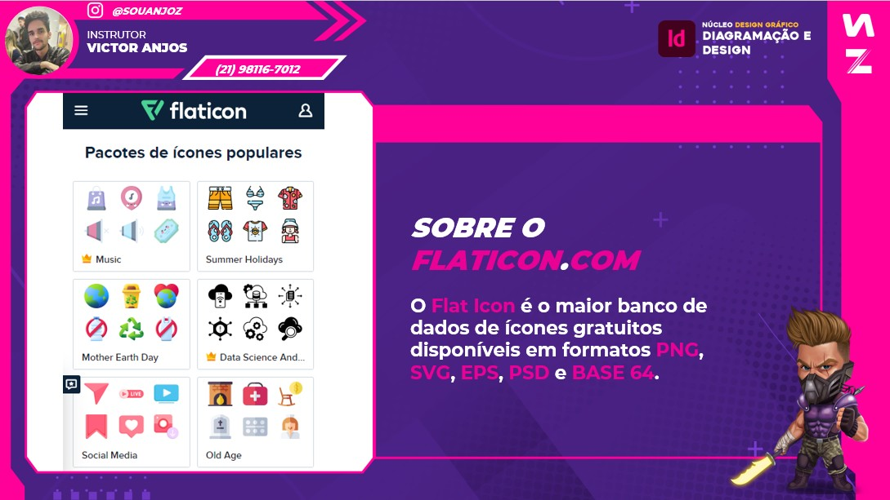
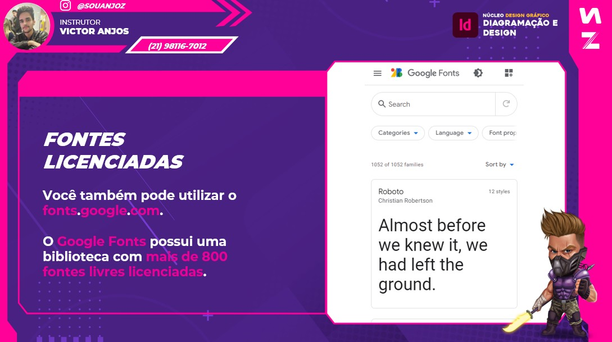
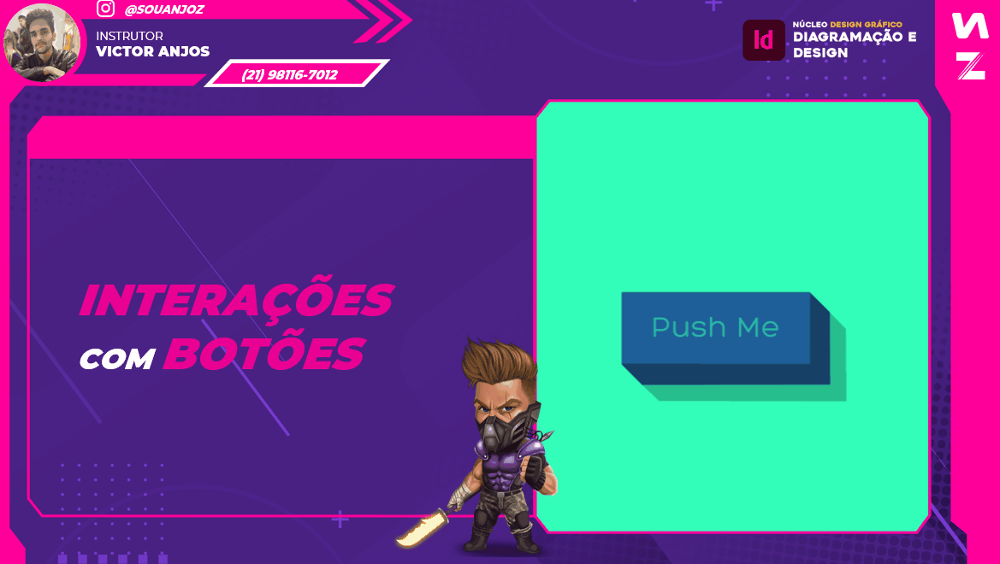
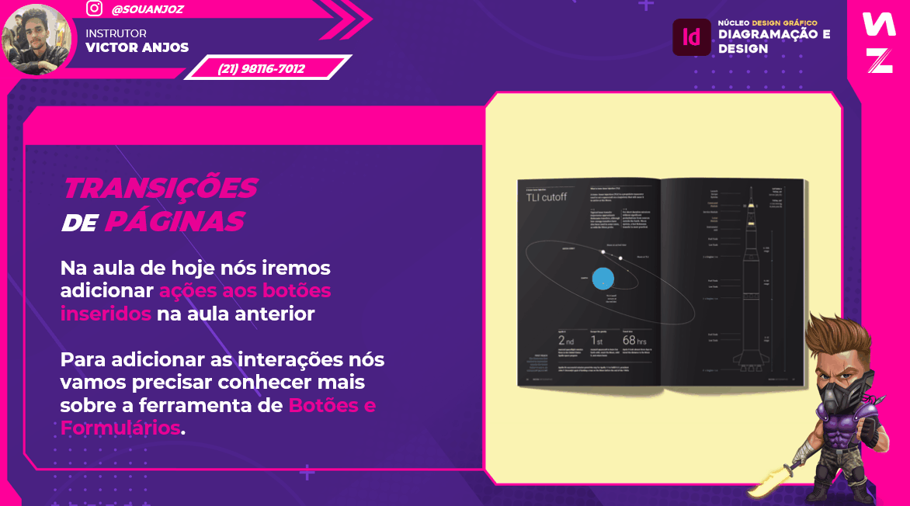
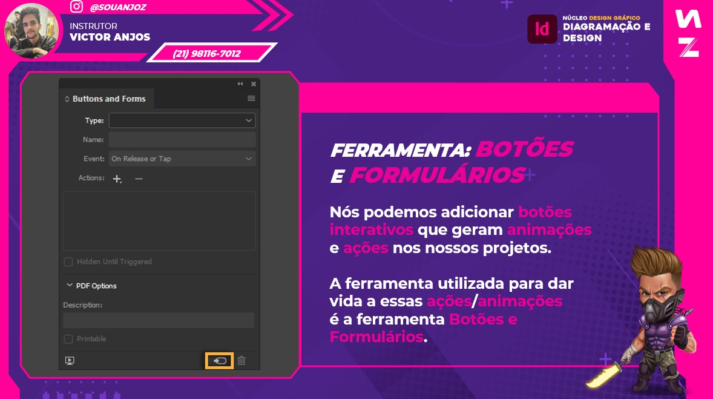

# Tópicos

[Introdução Indesign](#introdução-indesign)

[Interação entre programas](#interação-entre-programas)

[Gerando interações com botões](#gerando-interações-com-botões)

# Introdução Indesign

# Interação entre programas

# Gerando Interações com Botões

