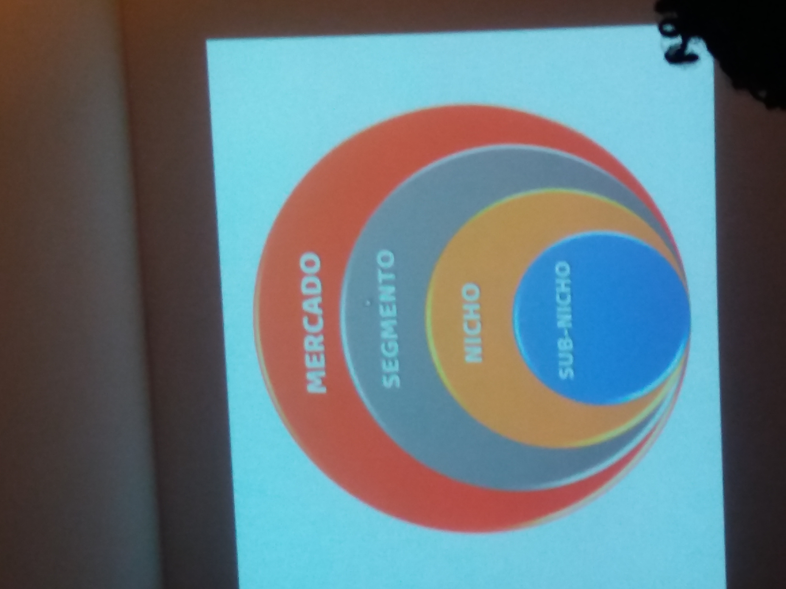

# Dícas

### Sites para trabalho com design gráfico

https://www.workana.com/

### Site para ver o tamanho de imagens para as mídias sociais

https://reportei.com/tamanho-de-imagens-para-as-midias-sociais/

# Tópicos
[Ilustator](#ilustrator-ai)

[Photoshop](#photoshoppsd)

[Indesign](#indesign-ind)

[Criação de Marca](#cria%C3%A7%C3%A3o-de-marca)

[Premiere Pro](#premiere-pro-propoj)

[After Effects](#after-efects)

[Autodesk Maya](#autodesk-maya-mb)

[Zbrush](#zbrush)

[Media Enconder](#media-enconder)

# Ilustrator (.AI)

### Princípios Básicos do Design
Alinhamento, proximidade, contraste e repetição

### Quais são os modos de cores para impressão web?
CMYK e RGB
CMYK - Ideal para impressão, ciano, magento, amarelho e preto
RGB - Ideal para cores baseadas em tela

### Quais são as cores primárias?
Azul, Vermelho e Amarelo. São cores que originam outras

### Oque é o Ilustrator?
è um programa de vetores e formas

### Quais são as ferramentas principais do Ilustrator?
**P** - Caneta
**V** - Seleção
**M** - Formas
**Ferramenta de texto** - Ferramenta de Texto
**Shift + M** - Construtor de formas

### Qual o atalho para colar no mesmo local no Illustator?
Ctrl+F

### Qual atalho para ferramenta seleção direta no Ilustrator
A -> Trabalha os pontos de encoragem de ilustração

### Qual é o atalho para o Pathfinder
CTRL+SHIFT+F9

### Quantas ferramentas compoe o Pathfinder
10. Sendo 4 encima e 6 embaixo

### Quantas funções existem na janela traçado da imagem no Ilustrator?
11

### Qual atalho para inserir uma imagem no Illustrator?
CTRL + SHIFT + P

### Qual atalho para ferramenta Malha no Illustrator
U -> Usado para deformar as linhas de um objeto

### Qual o caminho para criar um padrão no Illustrator
Objeto -> Padrão - Criar

# Photoshop(.PSD)

### Qual é a função do photoshop
Editar imagens e fotografias

### Qual atalho para inverter as cores de uma camada em uma mascara de camada
CTRL + I

### Multiplicar, dividir, luz indireta, sobrepor fazem parte de que grupo no Photoshop
São modos de mesclagem

### Qual é o atalho para predefinição de pinçel?
F5

### Qual o atalho para o Camera Raw
CTRL+SHIFT+A

### Qual atalho para ferramenta camada
F7

### Onde criamos um pinçel no photoshop
Menu editar -> criar

### Qual atalho para mesclar todas as camadas
CTRL + SHIFT + ALT + E -> Mescla e sem excluir as camadas

### Qual atalho para mesclar todas as camadas e criar um único arquivo
CTRL + E ou CTRL + ALT + E

### Qual atalho para agrupar um grupo de camadas
CTRL + G

# Indesign (.ind)

- Menu publicação Digital e modos de exportações
  
- Página Mestre e visualização em EPVB

### Qual atalho para inserir uma imagem no indesign
CTRL + D

### Qual é o atalho para visualização interativa de EPUB
ALT + SHIFT + ENTER

### Qual é o atalho para tabulações no indesign
CTRL + SHIFT + T

### Qual é o atalho para ferramenta quadro de retângulo no indesign
F

# Criação de Marca

- Moodboard
  
- Grupos Tipográficos

- Arquétipos das marcas

- Matriz de Eisenhower

- Tipos de nichos

- PDCA e 5W2H

# Premiere Pro (.propoj)

- Linha do tempo

- Planos de câmera, roteiro e Storyboard

- Ferramentas principais: 
v - seleção;

- Trabalha com arquivos brutos

### Premiere é um programa utilizado para?
Decupagem e principalmente edição de vídeo

### Oque é StoryBoard
È uma sequência de desenhos com o esboço das cenas pensadas para um vídeo

### Quantos softwares são específicos para trablhar com vídeo na linha da adobe?
1 - Premiere
2 - After Efects
3 - Audition

### Oque é Proxy no Premiere
Uma cópia dem baixa qualidade de um vídeo original

### Oque é uma edição não linear
É uma técnica de edição em que as cenas podem ser gravadas de modo arleatórios

### Quais são as etapas de uma produção Audiovisual
Pós-produção, produção, pós-produção

### Para que serve o atalho CTRL + K no Premiere
Para realizar um corte em um trecho do vídeo

### Qual a sequência do enquadramento de câmera
Plano Médio, Plano Americano, Primeiro Plano

### Qual a taxa de frames mais utilizado no cinema
24 FPS

### Em qual aspecto de vídeo se encaixa o formato 1920X1080
16:9 -> Formato Widescreen

### Oque é um Waveform
É uma representação visual de uma onda sonora

# After Efects

- Modos de renderização: av, mp4

- Composição e Keyframes

- Ferramentais principais - Camadas, renderização e efeitos

- Aplicação de Efeitos

### Qual atalho para duplicar uma camada no After Efects
CTRL + D

### Qual o efeito utilizado para remover o fundo verde no After Efects
Keylight 1.2

### Qual o codec de vídeo utilizado para conseguir um arquivo .MP4
H.264

### Qual é o atalho para posição no After Efects
P

### Qual atalho centraliza o ponto de ancoragem na composição no After Efects
CTRL + HOME

### Qual o nome do plugin que utilizamos para fazer o efeito de sabe de luz
Saber

### Quais são os tipos de Keyframes
Ease Ease - Começa devagar -> rápido -> devagar

Ease In -> Começa devagar -> rápido

Ease Out -> Começa rápido -> devagar

### Qual tecla utilizados para suavizar um keyframe
F9

### Qual é o atalho para parâmetro opacidade no After Effects
T

# Autodesk Maya (.mb)

- Design de Objetos 3D

- É um programa 3D

- Processo criativo

- Busca por referências

- Ferramentas básicas:

**Q** - Seleção
**W** - Mover
**E** - Rotação
**R** - Escalonar

**X** - Vermelho
**Y** - Verde
**Z** - Azul

### Qual o atalho para **Extrude** no maya
CTRL + F -> Da volume no desenho

### Qual o nome do Renderizador do Maya
Arnold

### Onde administramos a textura no Maya
No HyperShade

### Qual o nome do material fosco do Maya
Lambert

# Zbrush

### Qual o atalho para exibir as ferramentas no Zbrush
F1

### Qual o atalho para exibir ou retirar o lightbox no Zbrush
, (vírgula)

# Media Enconder

# Arquétipos das Marcas

# Planos

# 5W2H

# Divisão de Tarefas

# Mercados

