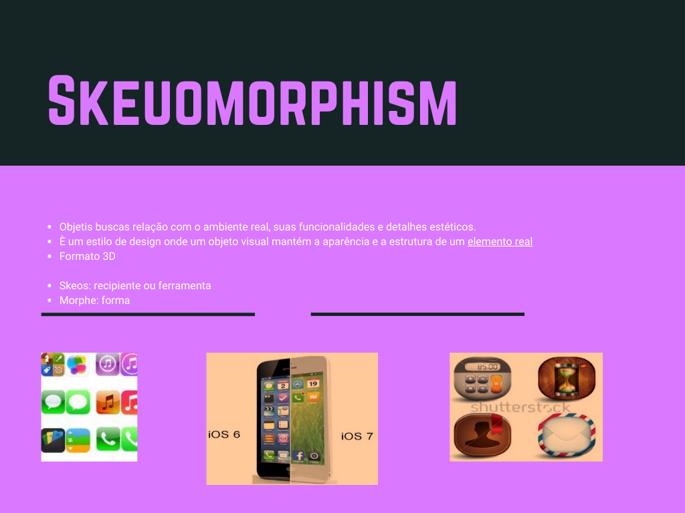
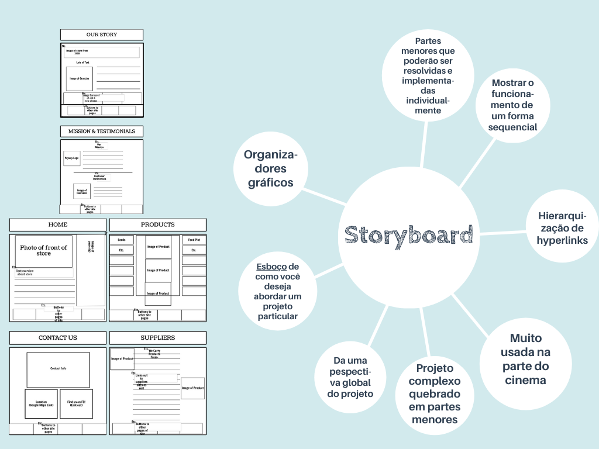
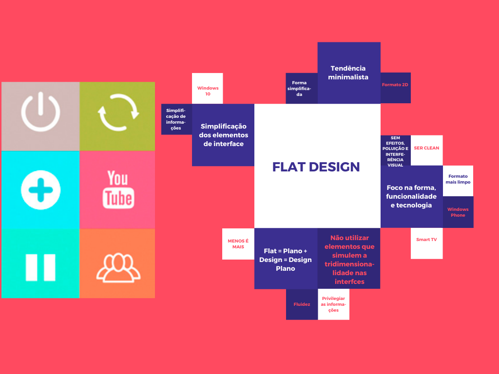

# Inicio De UmDesenvolvimento Web
 

# Anatomia De Uma Página Da Web

# Responsive Web Design

# BomDesign

# Skeuomorphism

# Equilibrio E Harmonia

# Storyboard

# FlatDesign

# TeoriaDoGrid

# Unidade-Layout

# Wireframe

# Wireframe X Protótipo X Mock

# Mock-Up

# Protótipo

