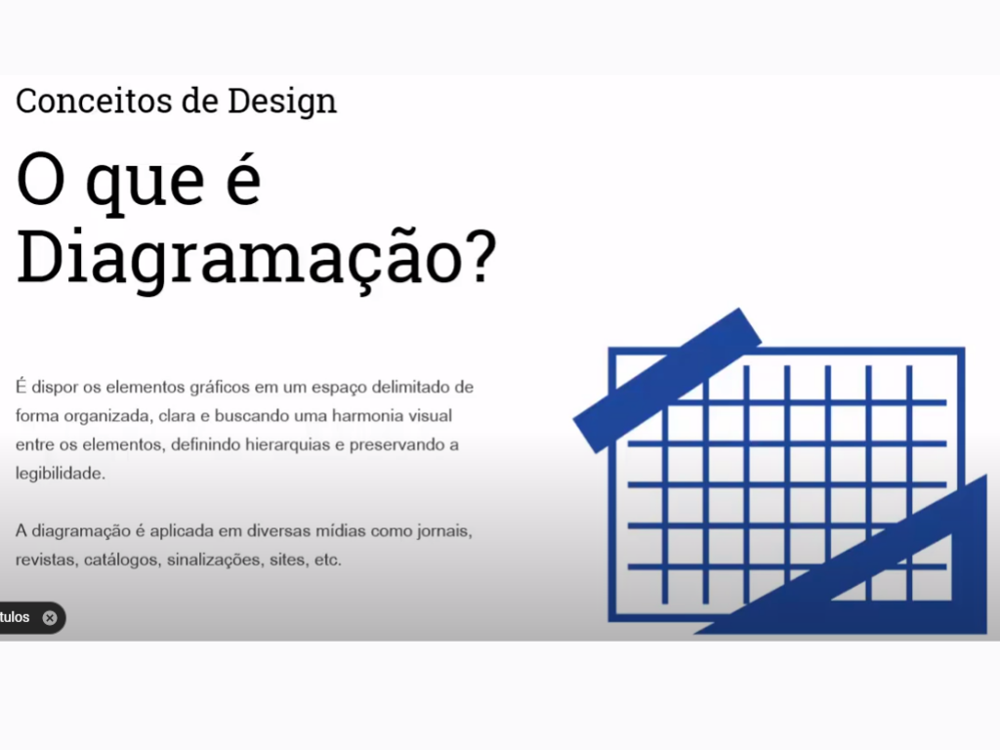
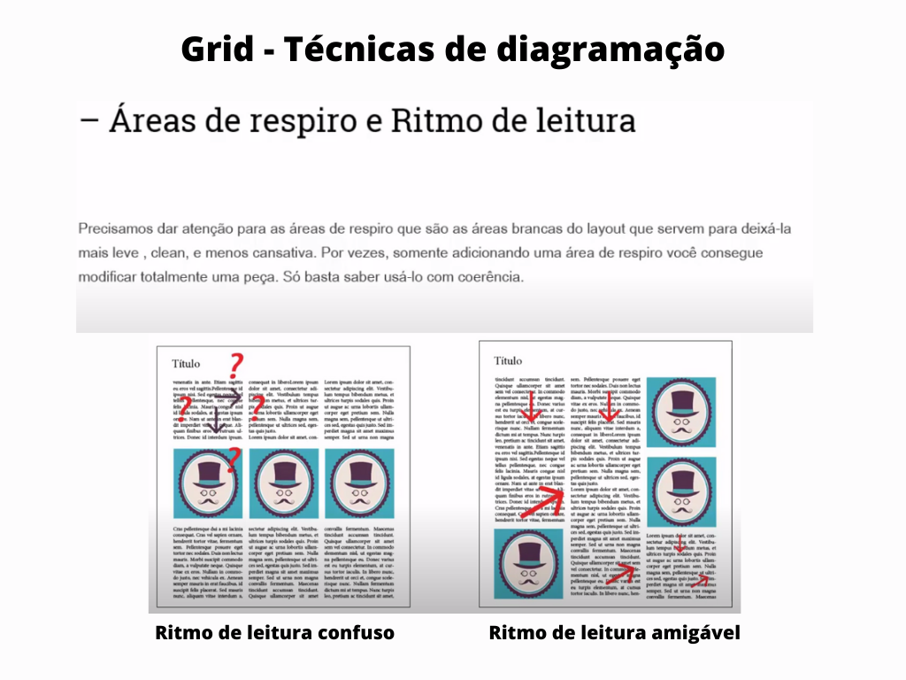
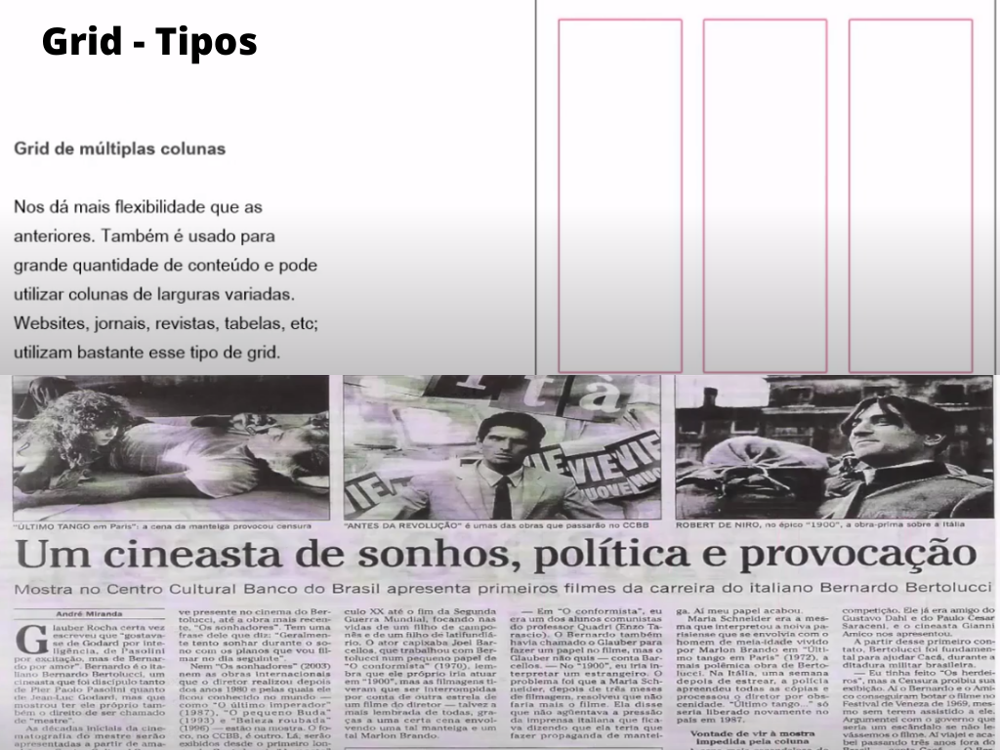
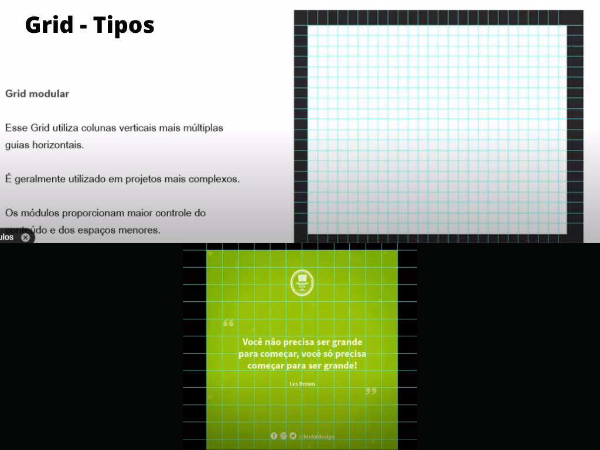
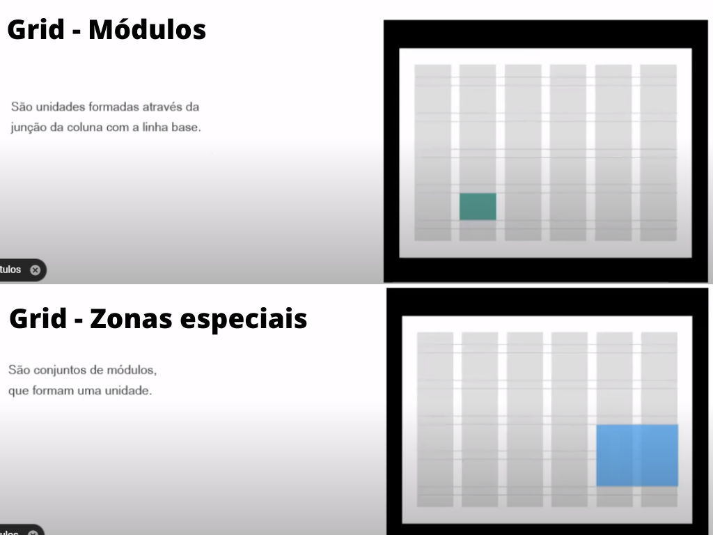

# Tópicos

[AnatomiaDeUmaPáginaDaWeb](#anatomia-de-uma-página-da-web)  

[ResponsiveWebDesign](#responsive-web-design)

[BomDesign](#bomdesign)

[Skeuomorphism](#skeuomorphism)

[EquilibrioEHarmonia](#equilibrio-e-harmonia)  

[Storyboard](#storyboard)

[FlatDesign](#flatdesign) 

[TeoriaDoGrid](#teoriadogrid)

[Unidade-Layout](#unidade-layout)

[InicioDeUmDesenvolvimentoWeb](#inicio-de-um-desenvolvimento-web)

[Wireframe](#wireframe)

[Mock-Up](#mock-up)   

[WireframeXProtótipoXMock-UP](#wireframe-x-protótipo-x-mock)

[Protótipo](#protótipo)

### Grids

[Diagramação](#diagramação)

[Áreas](#áreas)

[Tipos de Grid](#tipos-de-grid)

[Técnicas de Grid](#técnicas-de-grid)

# Inicio De Um Desenvolvimento Web
 

# [👆 TÓPICOS](#tópicos)

# Anatomia De Uma Página Da Web

# [👆 TÓPICOS](#tópicos)

# Responsive Web Design

# [👆 TÓPICOS](#tópicos)

# BomDesign

# [👆 TÓPICOS](#tópicos)

# Skeuomorphism

# [👆 TÓPICOS](#tópicos)

# Equilibrio E Harmonia

# [👆 TÓPICOS](#tópicos)

# Storyboard

# [👆 TÓPICOS](#tópicos)

# FlatDesign

# [👆 TÓPICOS](#tópicos)

# TeoriaDoGrid

# [👆 TÓPICOS](#tópicos)

# Unidade-Layout

# [👆 TÓPICOS](#tópicos)

# Wireframe

# [👆 TÓPICOS](#tópicos)

# Wireframe X Protótipo X Mock

# [👆 TÓPICOS](#tópicos)

# Mock-Up

# [👆 TÓPICOS](#tópicos)

# Protótipo

# [👆 TÓPICOS](#tópicos)

# Grids

# Diagramação 

# [👆 TÓPICOS](#tópicos)

# Áreas

            

# [👆 TÓPICOS](#tópicos)

# Tipos de Grid

  

# [👆 TÓPICOS](#tópicos)

# Técnicas de Grid

             

             

             

             

# [👆 TÓPICOS](#tópicos)