# Tópicos

[Vitrine De Projetos](#Vitrine-de-Projetos)

[Thumbnails](#Thumbnails)

[Criar Logos](#Criação-de-Logos)

[A Arte De Encantar Cliente](#A-Arte-de-Encantar-Clientes)

[Post Profissional para Instagram](#post-profissional-para-instagram)

[Ferramenta Caneta](#ferramenta-caneta)

[Ferramenta Construtor de Formas](#ferramenta-construtor-de-formas)

[Mockup](#Mockup)

[Precificação](#Precificação)

[Flyer Digital](#Flyer-Digital)

[Fechamento DeArquivo](#Fechamento-de-Arquivo)

[Criação De Capas Criativas](#Criação-de-capas-criativas)

[Pattern](#Pattern)

[Gigantografia](#Gigantografia)

[Manual De Marca](#Manual-de-Marca)

[Criar um Pixel Art](#criar-um-pixel-art)

[Criar um Voxel Art](#criar-um-voxel-art)

[Projeção Áurea](#projeção-áurea)

# Dicas

### Tamanho de Logos 

https://www.logaster.com.br/blog/logo-sizes/#:~:text=Na%20maioria%20das%20vezes%2C%20250,os%20dois%20layouts%20mais%20comuns

# Vitrine de Projetos

[Behance](https://www.behance.net/)
### Behance
- Trasmitir video ao vivo
- Currículo 
- Usar tags
- Autentificador NFTs

**NFT** - Artes autenticadas 

App myfont - detecta a fonte através da câmera do celular

Preciso me inspirar nas referências e não plagiar, posso utilizar para isso o painel semântico 

### Perfils de inspiração do behanced
Elijah Andrade

 [👆 TÓPICOS](#tópicos)

# Thumbnails

### Precificação

#### Exemplo de valores r$180 cada arte

8 artes por semana a r$180 = R$ 1.440
Faturamento mês =  ~ R$ 5.760

### Criar um texto com contorno
1. Janela -> Aparência 
2. Criar contorno
3. Fx
4. Estilizar - brilho interno e externo
5. 3D
6. Deformar

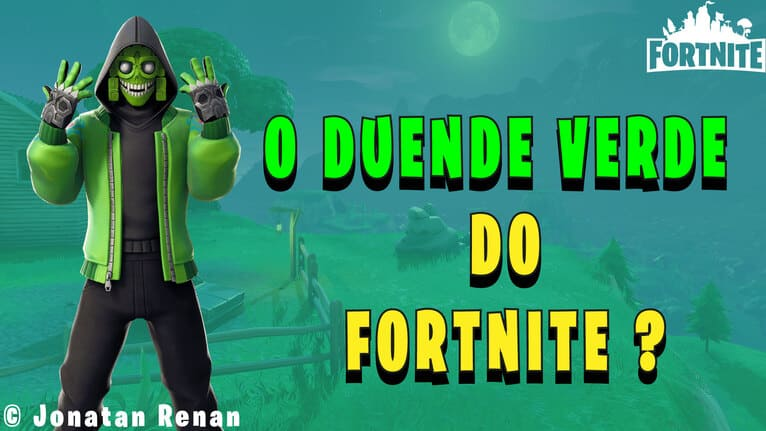

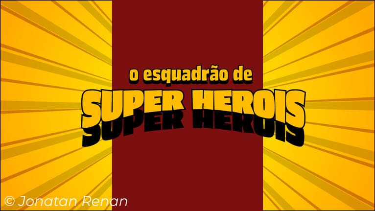

 [👆 TÓPICOS](#tópicos)

# Criação de Logos

Na maioria das vezes **250px** (largura) x **100px** (altura) são as dimensões ideias para uma página web

Para criar um logo pode utilizar as dimensões **36,86** Centímetros de largura x **26,81** Centímetros de altura

**Logofolio** - portfólio de logo

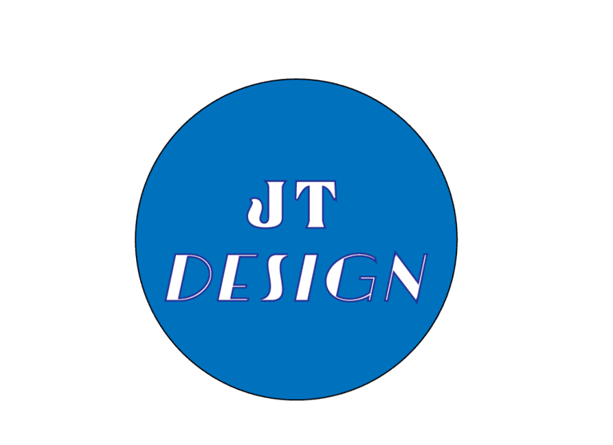
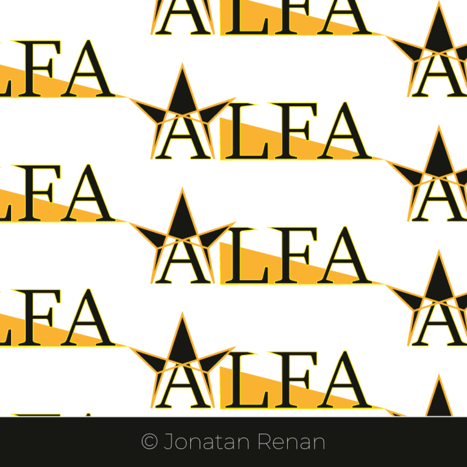

 [👆 TÓPICOS](#tópicos)

# A Arte de Encantar Clientes

O seu projeto está pronto, vamos marcar uma reunião para apresentar.

Objeto inteligente
Livetrasing

### Quanto posso ganhar com 
simulações 
Aplicações em marca
Logofolio

### Marketing simples
Postar no stores do instagram e colocar hashtags
Usar GTV, Rels - pequenos segundos de vídeo 

Para meios digitais é até 150dpi de resolução, de preferência 72dpia

 [👆 TÓPICOS](#tópicos)

# Post Profissional para Instagram

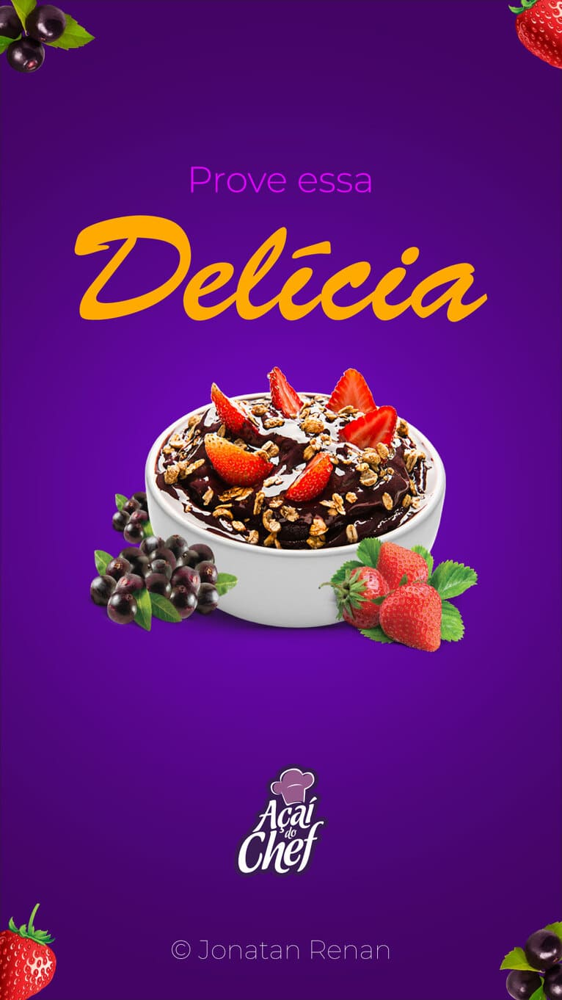

# Ferramenta Caneta

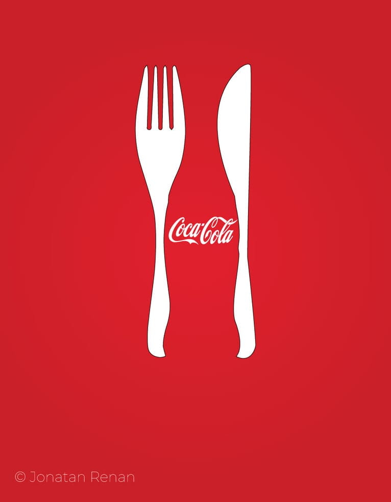

# Ferramenta Construtor de Formas

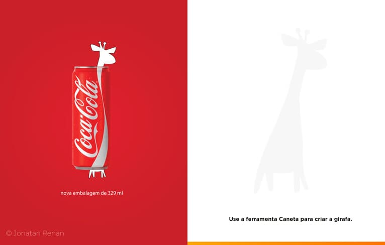

 [👆 TÓPICOS](#tópicos)

# Mockup

Site para mockups:
Free-mockup.com
Mockupword.co

https://camisadimona.com.br/
Dimona stampa para tudo

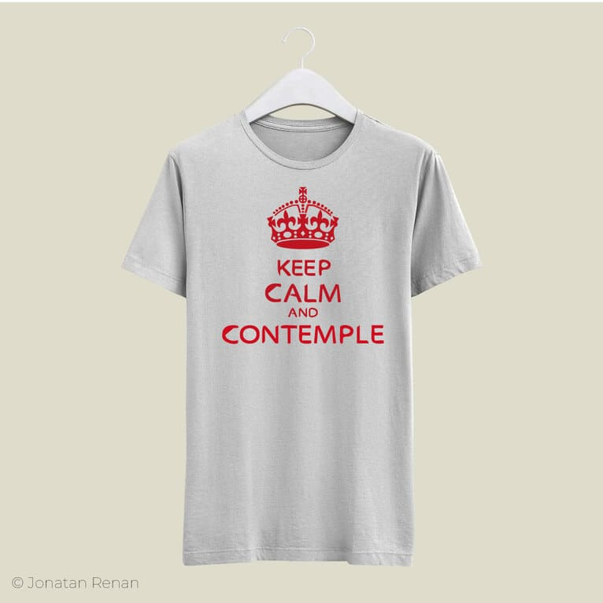
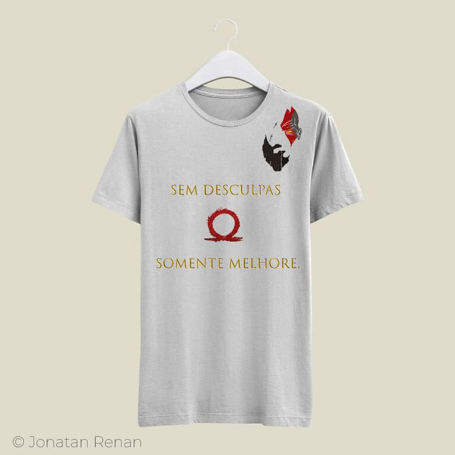
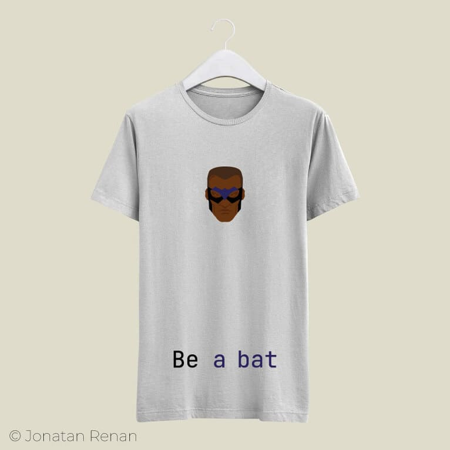

[👆 TÓPICOS](#tópicos)

# Precificação

Preciso ver o custo da hora aula

### Mercados
- Freelance - não é vinculado a empresa e pega trabalho por conta própria

### Ferramentas:
- [99freelas.com.br/app-calculadorafreelancer](https://www.99freelas.com.br/apps/calculadora-freelancer)
Ajuda a calcular a hr trabalhada

### Adegraf:
- Tabela referencial de valores 2017/2018
Associação dos design gráfico do Distrito Federal 
- http://www.adegraf.org.br/wp-content/uploads/2018/12/Tabela-ADEGRAF-2021-2022-WEB-MAR2021-1.pdf

### Como promover o meu trabalho
- Fazer parcerias
- Falar pra indicar depois que fizer o trabalho

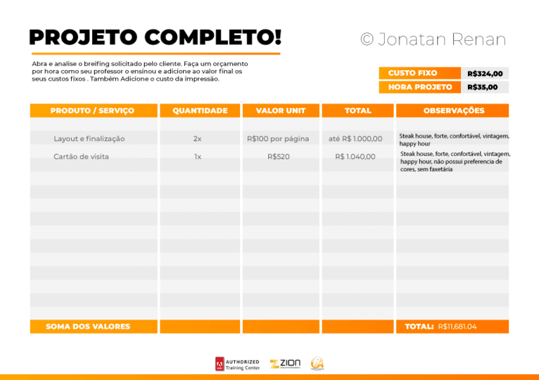
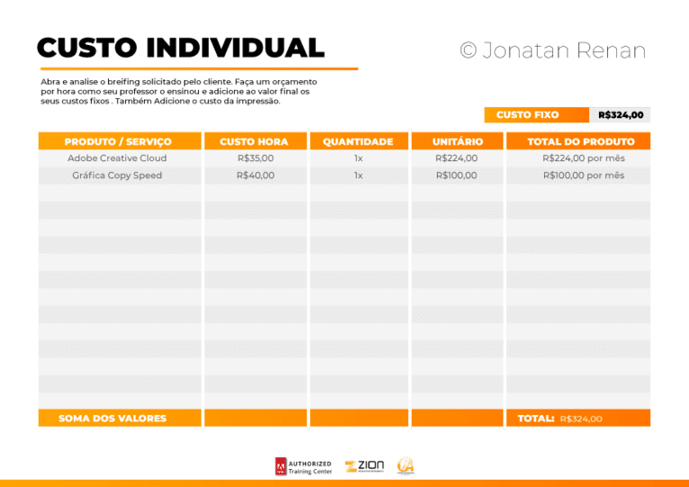

 [👆 TÓPICOS](#tópicos)

# Flyer Digital

### Tamanho de um flyer
15cm×25cm

**Habilitar sangria**
### Tamanho da Sangria
- 0,3 - 0,3 - 0,3 - 0,3
Ou 0,5 em cada

**Gabarito** é um arquivo predefinido pela própria gráfica 

Salvar cópia - pdf
Marca e sangrias
Marcas
Marcas de aparagem

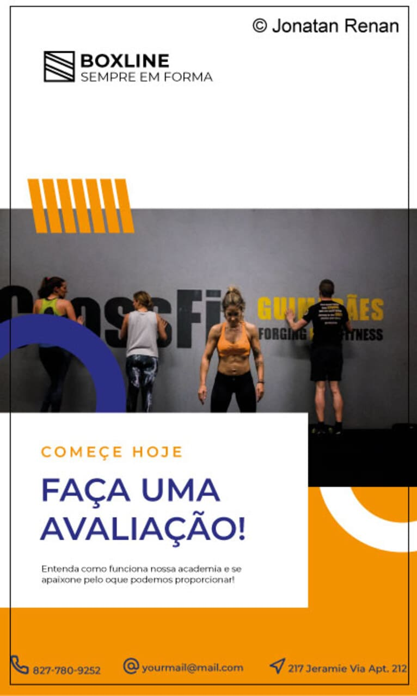

 [👆 TÓPICOS](#tópicos)

# Lucrando com convites

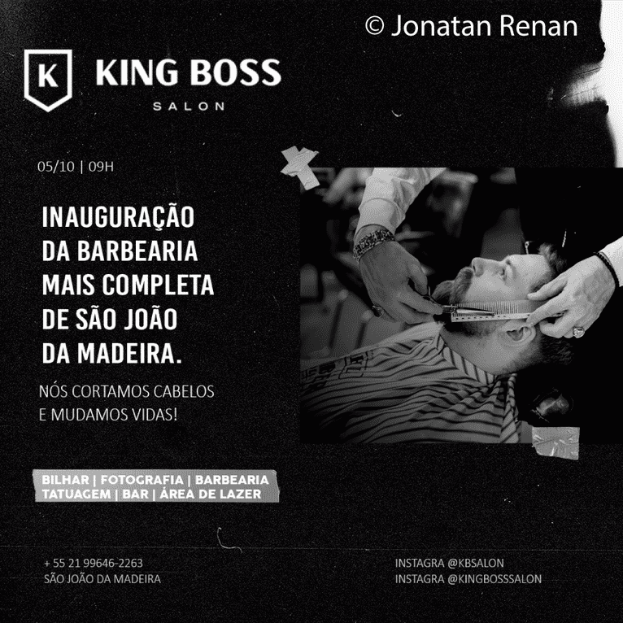

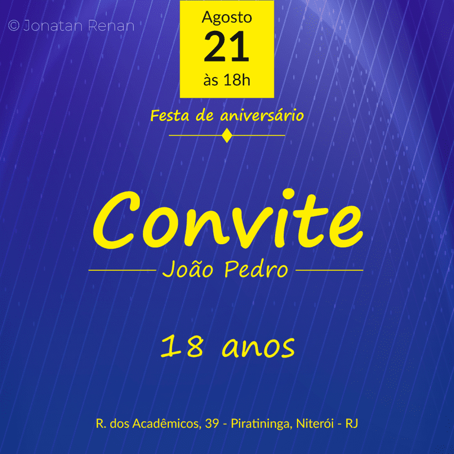

[👆 TÓPICOS](#tópicos)

# Fechamento de Arquivo

**Evitar mandar o arquivo editável**
**O editável pertence ao proprietário**

### Tipos de arquivos de imagem

- TIFF: guarda arquivos grandes sem perda de qualidade
- JPEG: guarda arquivos pequenos com qualidade normal
- PSD: Formato padrão do photoshop
- AI: Formatoo padrão do illustrator
- PDF: melhor formato para enviar arquivos para gráficas 
- SVG: preserva vetor e informações e abre no navegador

**Atenção com a qualidade das imagens, baixar sempre em FullHD**

### Como baixar uma imagem em FULL HD no google imagens
1. Pesquisar a imagem no google
2. Ferramentas - imagens - grande
3. Imagem - Abrir em uma nova guia 
4. Salvar imagem como

### Gráficas recomendadas:
- Copy Speed - gráfica offline
- Zap a gráfica da gráfica 
- Padrão Color - entrega a impressão na minha porta

Antes de dar um preço veja qual medida e o preço nas gráficas acima, optando pelo mais barato e de melhor qualidade 

**Habilitar sangria**
### Tamanho da Sangria
- 0,3 - 0,3 - 0,3 - 0,3
Ou 0,5 em cada

**Gabarito** é um arquivo predefinido pela própria gráfica 

1. Salvar cópia - pdf
2. Marca e sangrias
3. Marcas
4. Marcas de aparagem

 [👆 TÓPICOS](#tópicos)

# Criação de capas criativas

### Ferramentas do Illustrator
- Malha
- Distorção de envelope
- Espaço da margem 

Capa tem q ser condizente com o conteúdo 

### Tipos de capas
Capa para livro 
Post criativovp
Capa para e-book 

### Preçificação

- A partir de R$150 por design de capa 
- Até 10 projetos por mês 

### Tamanho
15cmx25cn

### Inspirações para capa de livro 
- Behanced
- Pinterest
- Unsplash

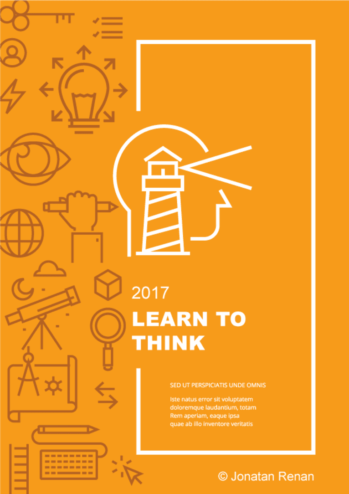

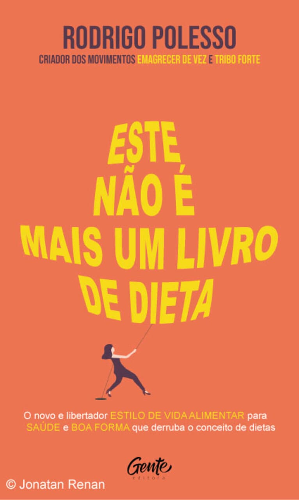

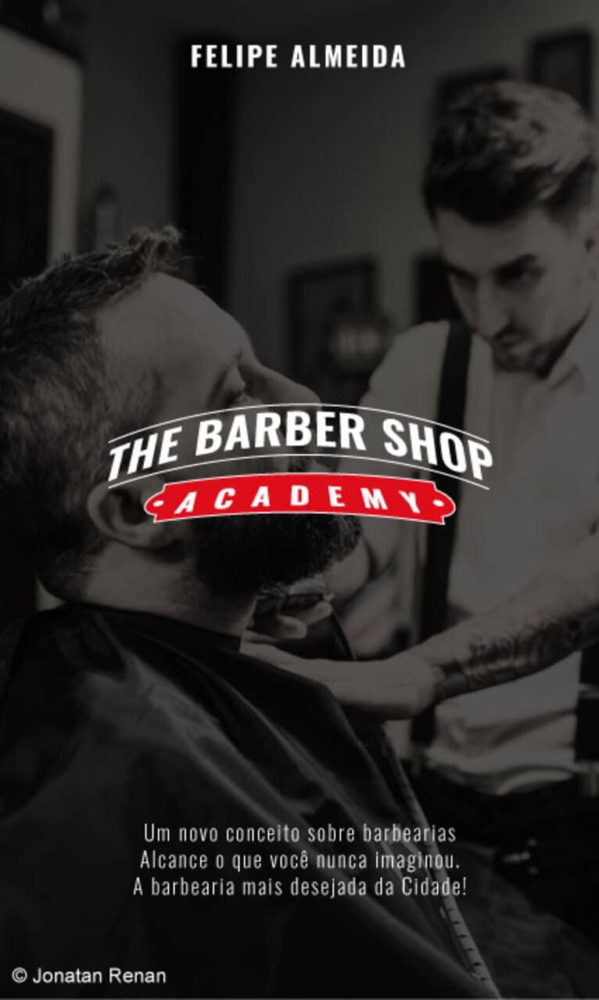

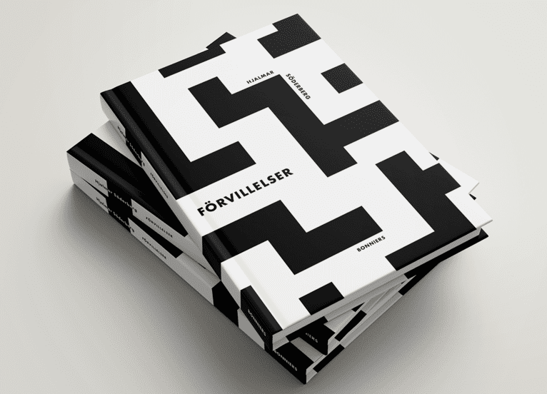

 [👆 TÓPICOS](#tópicos)

# Pattern

Oque é pattern - simbolos que se repetem

### Tipos de Patterm
- Patterm em estampas
- Pattern em branding
- Pattern animada

### Como cobrar
- Valor baseado no que estou produzindo
- Não cobrar pelo padrão
- Eu sou artista se quiser trabalho amador procura outro
- Pagar pela prioridade é perigoso

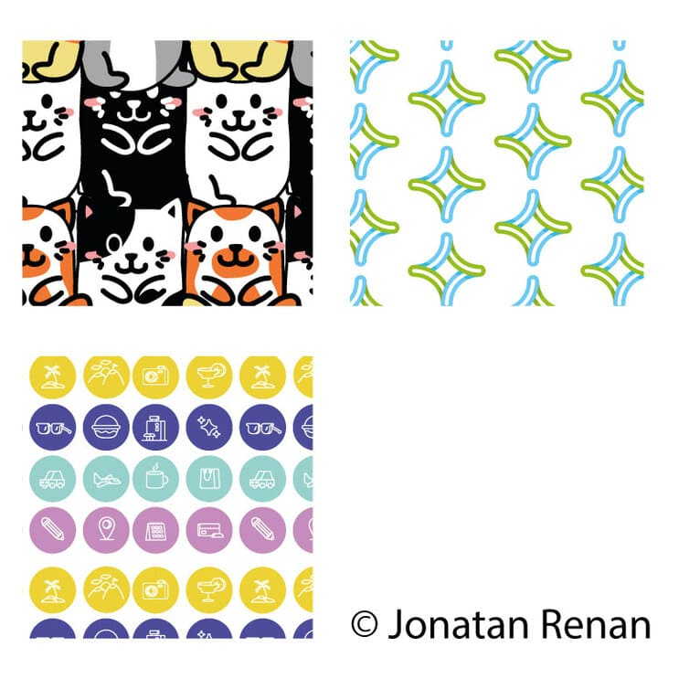

 [👆 TÓPICOS](#tópicos)

# Gigantografia

A partir de R$120 em baner 80 por 1
Até 5 projetos mensais

**Qual é a medida do banner?**

### Tamanho
3:1
### Impressão 
3cm - 3 x 10 - 30cm
1cm - 1 x 10 - 10cm

**Onde ele será aplicado?**
**Logotipo, informação do banner (resumido)**

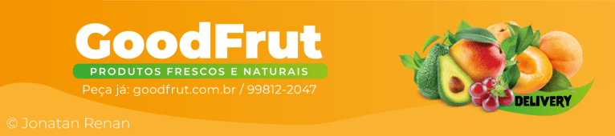
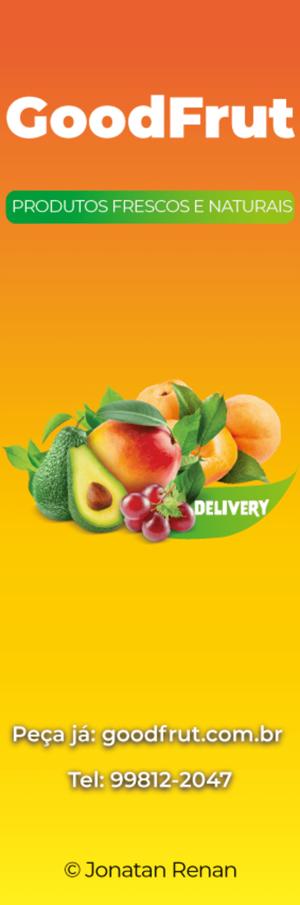

[👆 TÓPICOS](#tópicos)

# Manual de Marca

https://www.behance.net/gallery/134700007/Manual-de-Marca-Stay-Strong

 [👆 TÓPICOS](#tópicos)

# Criar um Pixel Art

1. Cria um quadrado sem preenchimento sobre o pixelart
   
2. Objeto -> Caminho -> divir em grade -> Visualizar -> Grade - 20 X 20
   
3. Balde de tinta em tempo real
   
4. Bloqueia a pixelart
   
5. Cria um grupo de pintura, pintando e arrastando sobre o objeto
   
6. Expandir

# Criar um Voxel Art

### Oque é um Voxel Art?
É um pixel numa forma ou 3D. Pense no pixel com um quadrado simples e o voxel um cubo

### TRABALHANDO COM 3D

Efeitos de 3D
Extrusão e Bisel
Expandir as formas
Entendendo a perspectiva
Organizando camadas

### APLICANDO CORES E SOMBRAS

Ferramenta seleção direta para selecionar as faces
Crie novas oportunidades

1. Editar -> preferencia -> Linhas e grade -> Grade a cada 10px e 2 subdivisões
   
2. Exibir -> Mostrar grade -> CTRL + ~
   
3. Exibir -> Encaixar na grade
   
4. Exibir -> Ocultar grade
   
5. Faz o pixelart com a ferramenta Pinçel em tempo real
   
6. Seleciona os objetos que deseja unilos e CTRL + SHIFT + F9 (Pathfinder) unir
   
7. Clicka no objeto unido, Efeito -> 3D -> Extrusão e BISEL
   
8. Deixa padrão, marca a opção Visualizar. Profundidade 200pt (Exemplo)
   
9.  Com o objeto selecionado. Objeto -> Expandir aparência
    
10. Seleção direta -> seleciona o objeto -> CTRL+C, NOVA CAMADA, -> CTRL+V

A profundidade de extrusão varia de acordo com objeto

Quando expando consigo selecionar faces do objeto

Com os olhos eu coloco o vértice encima da linha do rosto inferior e depois subo os dois olhos

Posso dar um efeito de luz, colocando as partes superiores mais claras

Posso suavizar algumas partes do pixelart

Selecao direta - seleciona o objeto - ctrlc c, nova camada e ctrlv

Com os olhos eu coloco o vértice encima da linha do rosto  e dps subo os dois

- ajustar o olho-  colocar a parte da frente mais claro pra dar o efeito de luz

- suavizar algumas partes do objeto

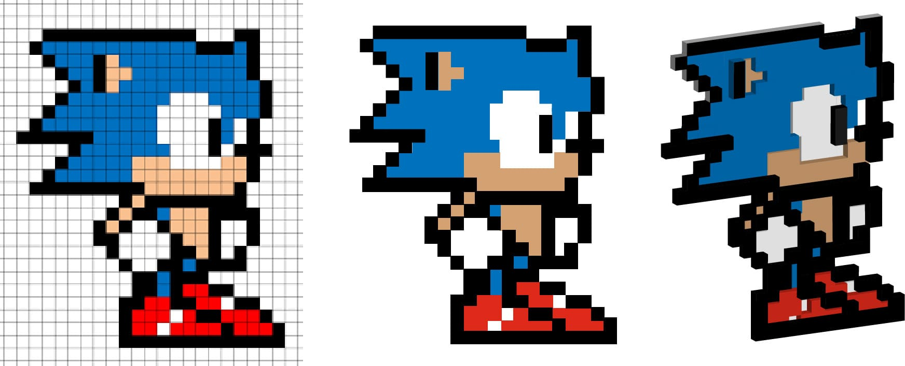

[👆 TÓPICOS](#tópicos)

# Projeção Áurea

Entendendo a proporção áurea
Trabalhando com círculos
construindo logos e formas
expolorando o balde de tinta em tempo real

Entendendo a proporção áurea
- sequência de Fibonnaci
- Presença na Natureza
- Construindo no illustrator

1- Pego a proporção Àurea

2- Coloco a proporção Áurea na forma completa e coloco no desenho

3- Encaixo a proporção Áurea de acordo com desenho, desagrupando conforme for necessário

4- Aumento o traçado pra ficar de acordo com o desenho

4- Seleciono tudo e vou em Objeto -> Expandir

5 - Uso a ferramenta de Bande de tinta em tempo real, deixo só a opção traçado marcado

6 - Desagrupo e Retiro as partes desnecessárias

7 - Seleciono tudo e pathfinder -> unir

CTRL + SHIF + F9

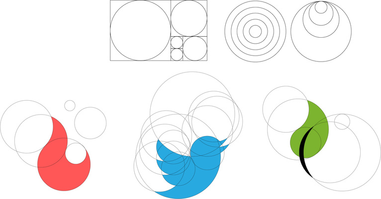

 [👆 TÓPICOS](#tópicos)
