# Tópicos

[Tipografia](#tipografia)

[Imagens](#imagens)

[Cores](#cores)

# Tipografia

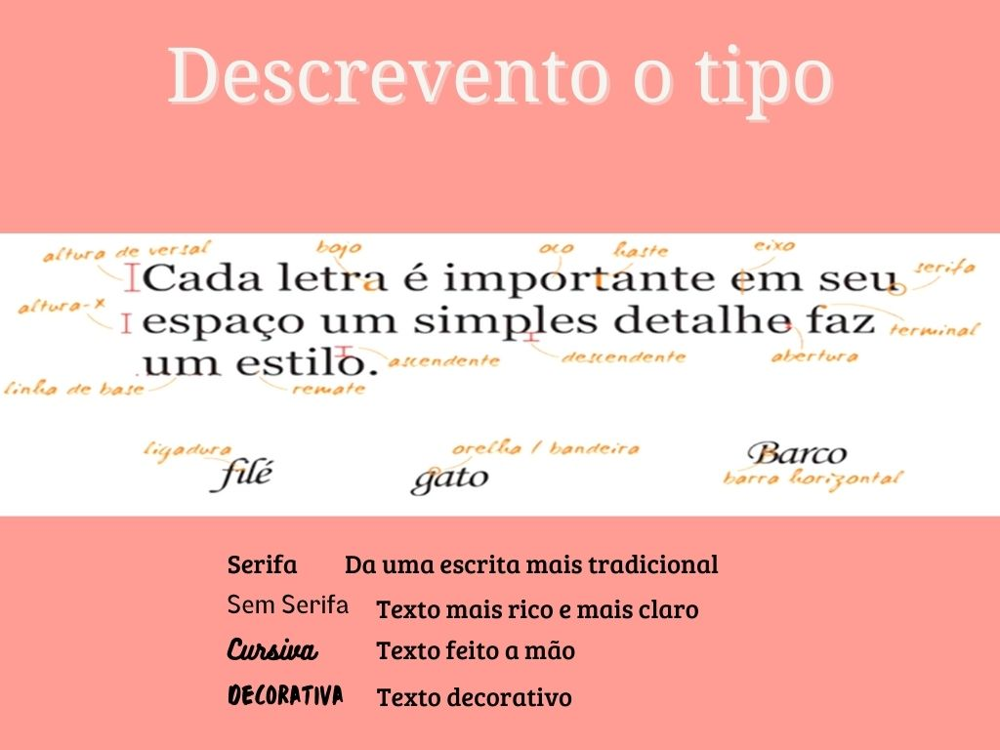

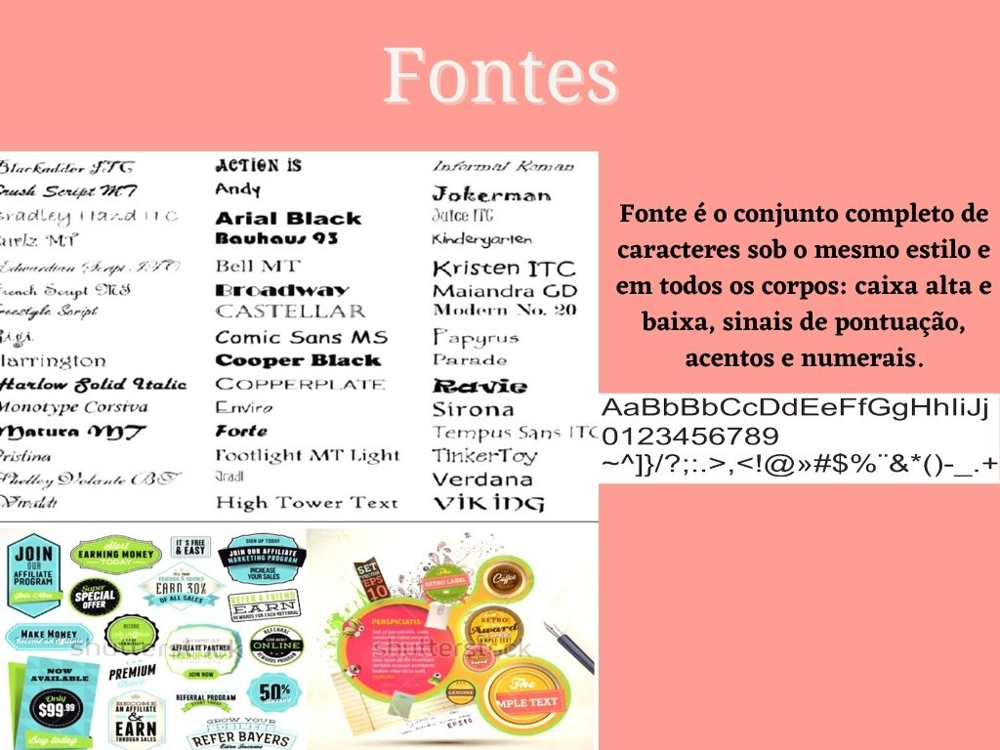

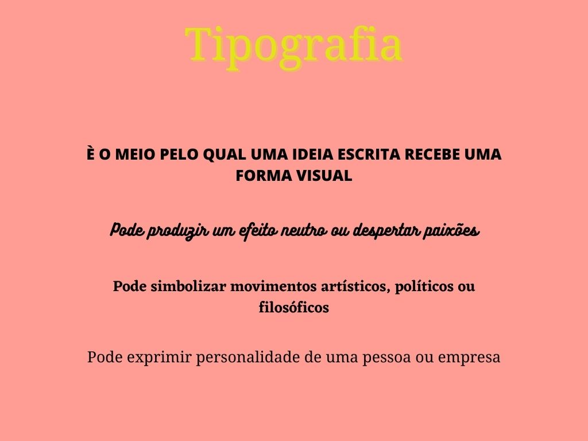

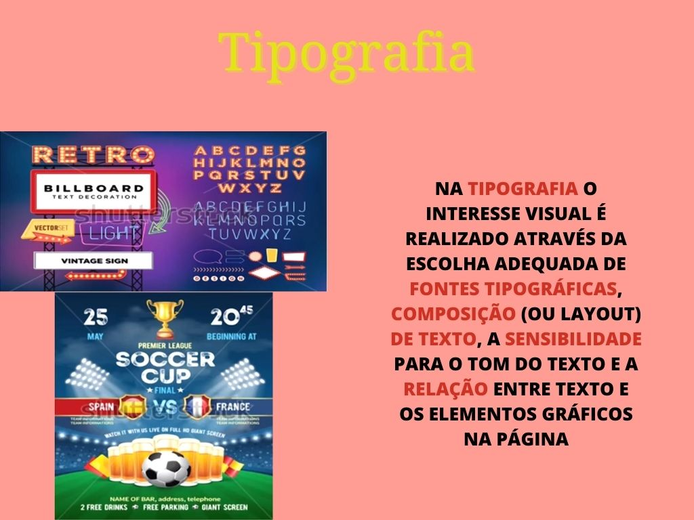

# [👆 TÓPICOS](#tópicos)

# Imagens

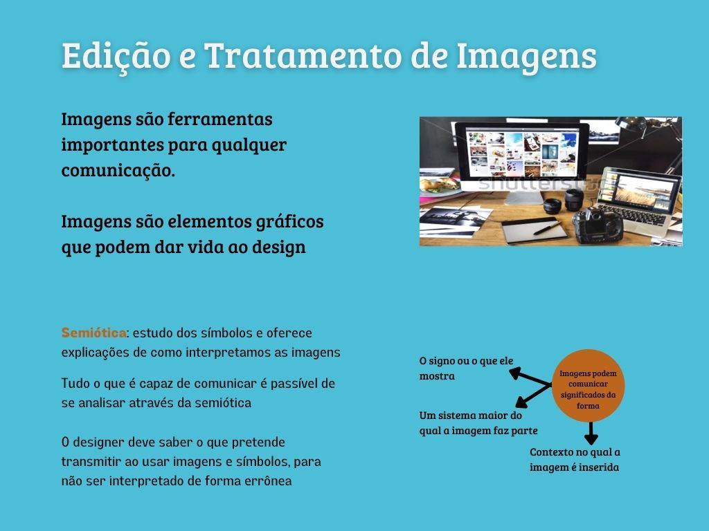  

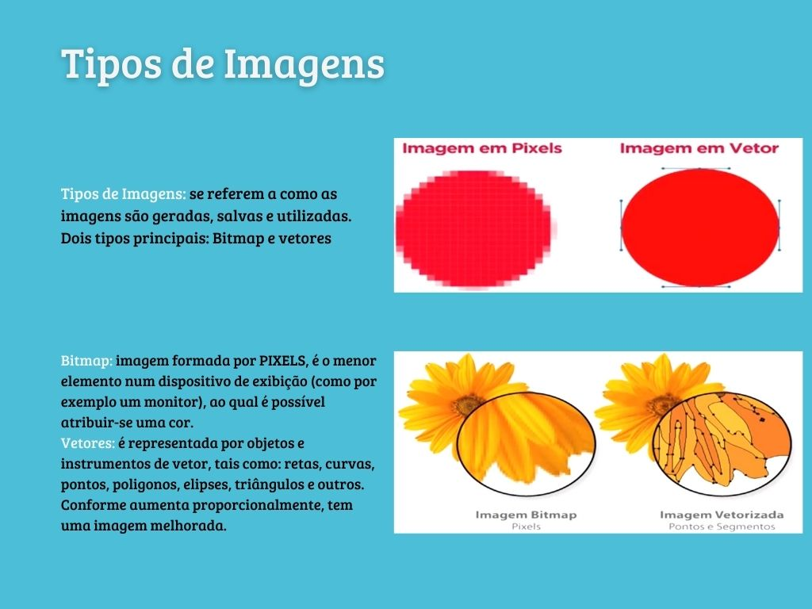

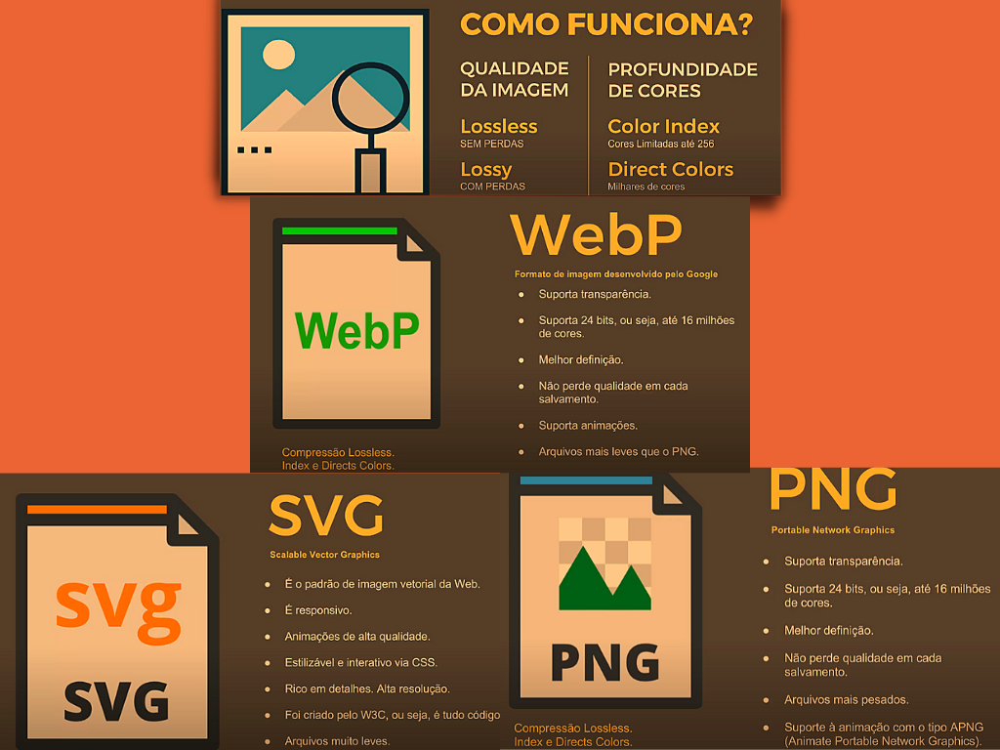 

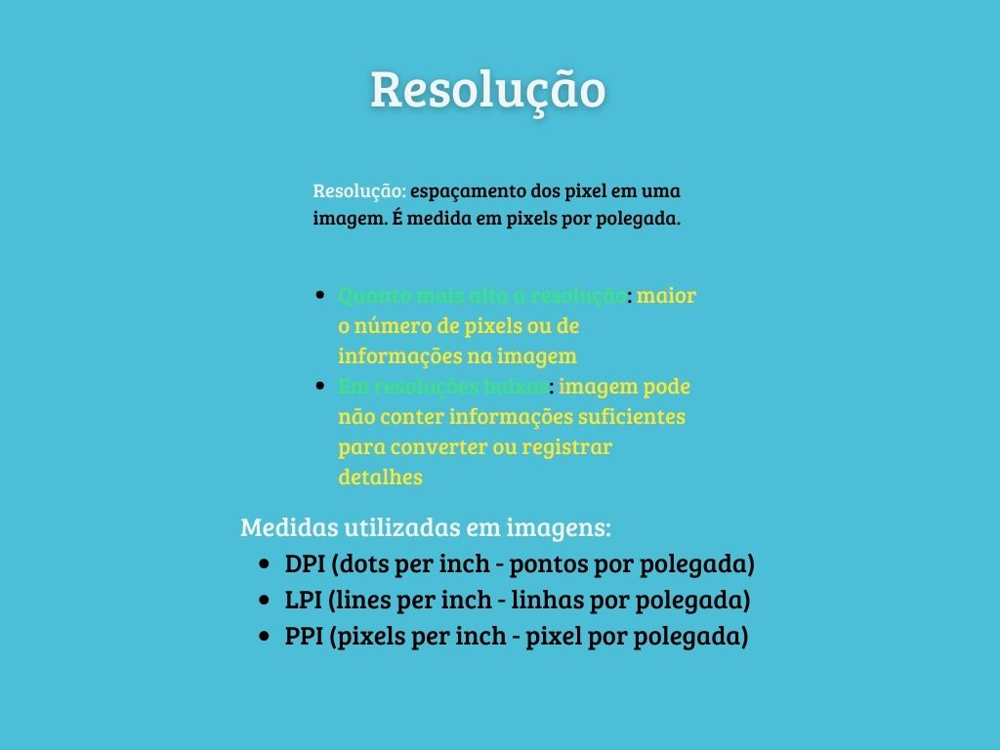 

# [👆 TÓPICOS](#tópicos)

# Cores

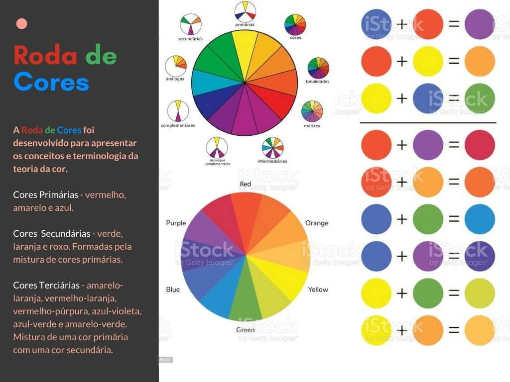

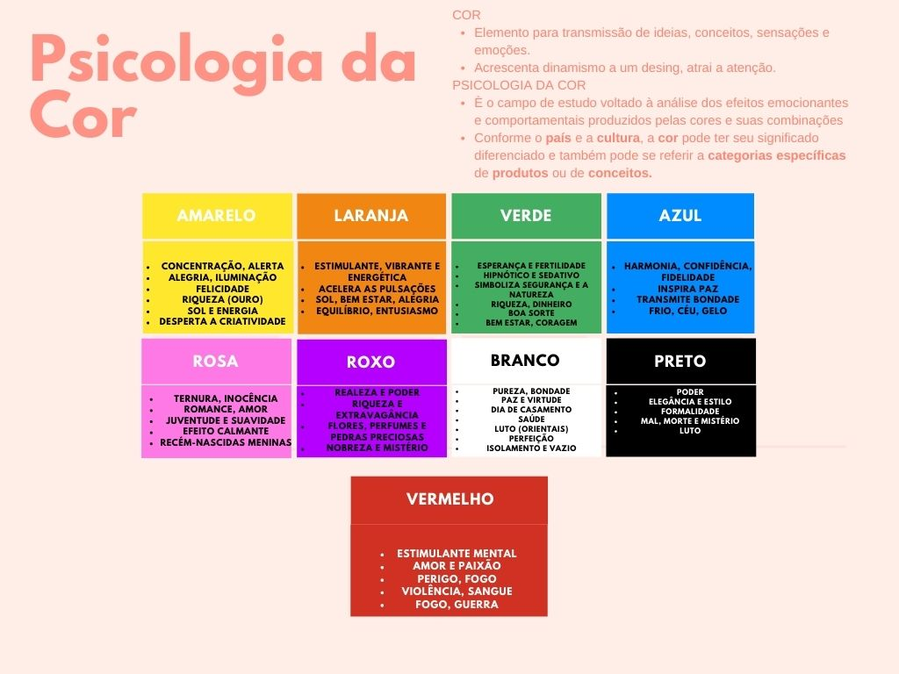  

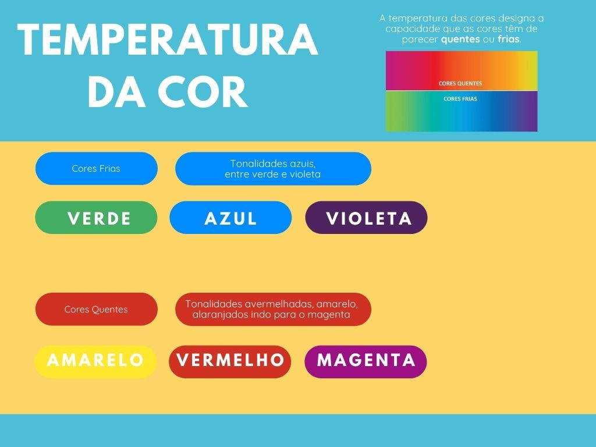

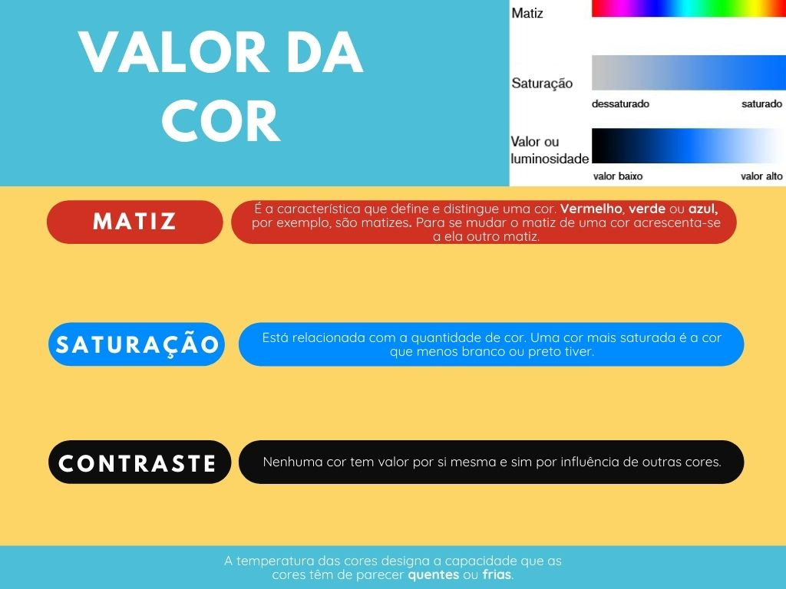

# [👆 TÓPICOS](#tópicos)

